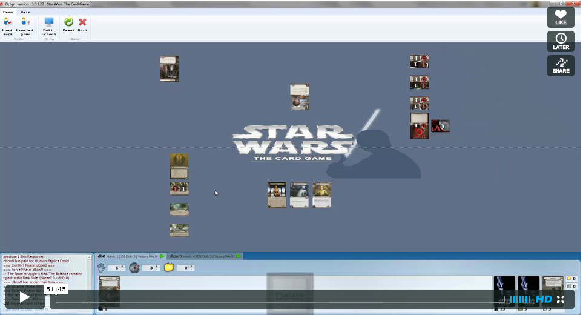

Star Wars:The Card Game LCG plugin for OCTGN
=========================
In Star Wars: The Card Game, light side and dark side players duel for the fate of the galaxy.

*While the light side player races to make tactical strikes against dark side objectives, the dark side player works to reinforce their position of command.*

This is a game definition for the [Online Card and Tabletop Gaming Network (OCTGN)](http://octgn.net). Its card effects are almost completely automated to allow for smoother play and prevent mistakes

Enjoy!

Available Sets
---------

While you can play the game with the auto-generated proxies, if you've already memorized the cards, the censored images will allow you to play and recognise cards quicker.
Sets will be uncensored after 6 months.

* [Core](http://octgn.dbzer0.com/SWLCG/o8c/SW-LCG-Core.o8c) *(Censored)*
* [Desolation of Hoth](http://octgn.dbzer0.com/SWLCG/o8c/SW-LCG-Desolation-Of-Hoth.o8c) *(Censored)*
* [The Search for Skywalker](http://octgn.dbzer0.com/SWLCG/o8c/SW-LCG-The-Search-For-Skywalker.o8c) *(Censored)*
* [A Dark Time](http://octgn.dbzer0.com/SWLCG/o8c/SW-LCG-A-Dark-Time.o8c) *(Censored)*

If you have the sets already from OCTGN 3.0 and you want to convert them to 3.1 without redownloading, [check this guide](https://github.com/kellyelton/OCTGN/wiki/o8c-conversion-guide).

If you have your own scans and want to use those instead of the censored card, you can [follow this guide to do so](https://github.com/kellyelton/OCTGN/wiki/o8c-modification-guide).

Tutorials
---------

Step-by-Step Tutorial Video *(This is from v.1.0.2 and it's kinda obsolete and needs to be updated, but it will show you the basics. The current plugin is much more advanced.)*

Other Links
---------
* [Official Site](http://www.fantasyflightgames.com/edge_minisite_sec.asp?eidm=175&esem=1)
* [Plugin Forum](http://octgn.gamersjudgement.com/viewforum.php?f=55)
* [OCTGN Game Definition Changelog](changelog.md)

Screenshots
---------
(Click for larger size)

The Dark side destroys the last objective to win the game

Demo game at v1.0.0

